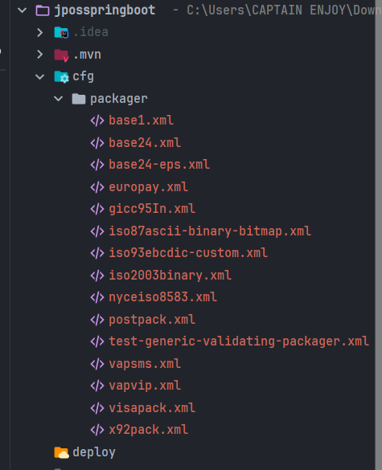
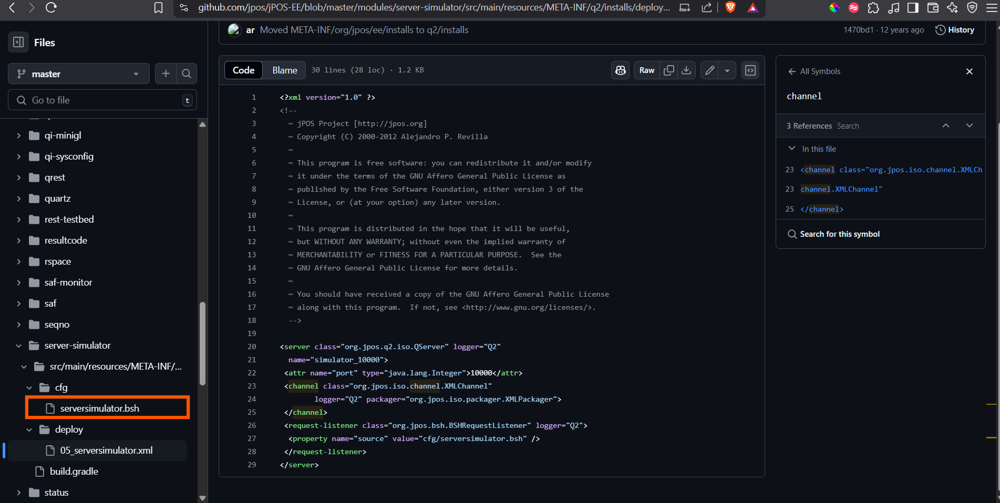
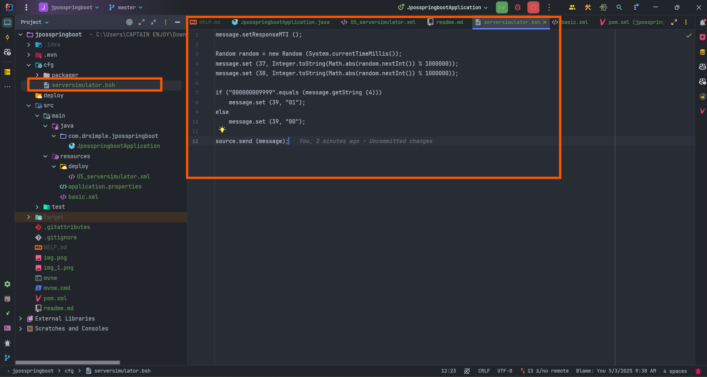
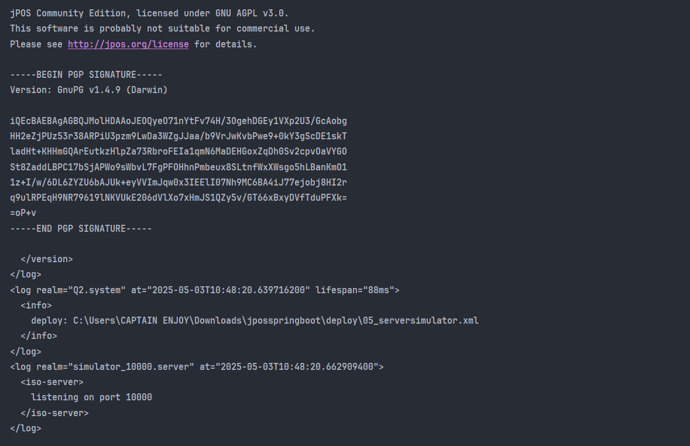
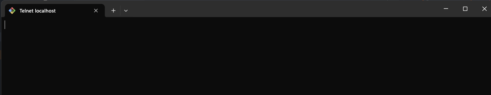
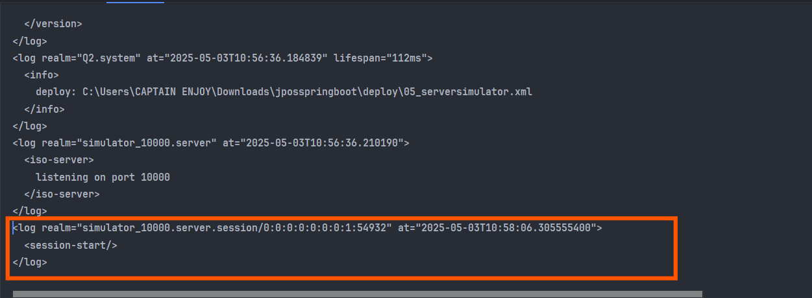
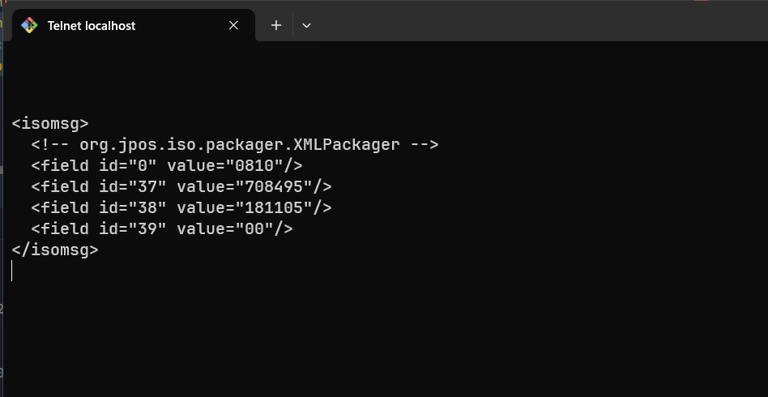

### Create a jpos server
Go to spring starter and create a spring boot project with no dependency

### Run
- add the jpos dependency in the pom.xml file.
```xml
 <dependencies>
        <dependency>
            <groupId>org.jpos</groupId>
            <artifactId>jpos</artifactId>
            <version>2.1.7</version>
        </dependency>
    </dependencies>
```

### Create a server
Method 1
```java
package com.drsimple.jposspringboot;

import org.jpos.q2.Q2;
import org.springframework.boot.CommandLineRunner;
import org.springframework.boot.SpringApplication;
import org.springframework.boot.autoconfigure.SpringBootApplication;

@SpringBootApplication
public class JposspringbootApplication implements CommandLineRunner {

    public static void main(String[] args) {
        SpringApplication.run(JposspringbootApplication.class, args);
    }

    @Override
    public void run(String... args) throws Exception {
        Q2 q2 = new Q2();
        Thread thread  = new Thread(q2);
        thread.start();
    }
}

```

Run: `mvn clean install`

Response:
```xml
<log realm="Q2.system" at="2025-05-03T07:51:35.351053200">
  <info>
    Q2 started, deployDir=C:\Users\CAPTAIN ENJOY\Downloads\jposspringboot\deploy, environment=default
  </info>
</log>
<log realm="Q2.system" at="2025-05-03T07:51:35.869952200" lifespan="515ms">
  <version>
    jPOS 2.1.7 master/7079725 (2022-01-22 18:50:13 UYT) 

-----BEGIN PGP SIGNED MESSAGE-----
Hash: SHA1

jPOS Community Edition, licensed under GNU AGPL v3.0.
This software is probably not suitable for commercial use.
Please see http://jpos.org/license for details.

-----BEGIN PGP SIGNATURE-----
Version: GnuPG v1.4.9 (Darwin)

iQEcBAEBAgAGBQJMolHDAAoJEOQyeO71nYtFv74H/3OgehDGEy1VXp2U3/GcAobg
HH2eZjPUz53r38ARPiU3pzm9LwDa3WZgJJaa/b9VrJwKvbPwe9+0kY3gScDE1skT
ladHt+KHHmGQArEutkzHlpZa73RbroFEIa1qmN6MaDEHGoxZqDh0Sv2cpvOaVYGO
St8ZaddLBPC17bSjAPWo9sWbvL7FgPFOHhnPmbeux8SLtnfWxXWsgo5hLBanKmO1
1z+I/w/6DL6ZYZU6bAJUk+eyVVImJqw0x3IEElI07Nh9MC6BA4iJ77ejobj8HI2r
q9ulRPEqH9NR79619lNKVUkE206dVlXo7xHmJS1QZy5v/GT66xBxyDVfTduPFXk=
=oP+v
-----END PGP SIGNATURE-----

  </version>
</log>

```


### JPOS QServer and BSHRequestListener
QServer is a jPOS server that listens for incoming messages and processes them.
BSHRequestListener is a jPOS listener that uses BeanShell to process incoming messages.
To start:
- Go to jpos github and download the latest version of jpos. github url: https://github.com/jpos/jPOS/tree/main/jpos
-  git clone https://github.com/jpos/jPOS.git
- clone, unzip and copy the package folder in the jpos/src/dist/cfg folder.
- in your project, create a new folder called cfg and paste the package folder from the jpos package.

- Next create a deploy folder in the root of your project.
- Paste the 05_serversimulator.xml file in the deploy folder. url: https://github.com/jpos/jPOS-EE/blob/master/modules/server-simulator/src/main/resources/META-INF/q2/installs/deploy/05_serversimulator.xml
the content looks like
```xml

<?xml version="1.0" ?>
<server class="org.jpos.q2.iso.QServer" logger="Q2"
  name="simulator_10000">
 <attr name="port" type="java.lang.Integer">10000</attr>
 <channel class="org.jpos.iso.channel.XMLChannel"
        logger="Q2" packager="org.jpos.iso.packager.XMLPackager">
 </channel>
 <request-listener class="org.jpos.bsh.BSHRequestListener" logger="Q2">
  <property name="source" value="cfg/serversimulator.bsh" />
 </request-listener>
</server>
```

We need to create the cfg/serversimulator.bsh file. Then copy the content in the cfg



Then start the app, you should have:



### Open another terminal and run the following command
```bash
telnet localhost 10000
```
 

on connect you should see the following message
```xml


### Then lets compose an iso8583 message
```xml
<isomsg>
    <field id="0" value="0800"/>
</isomsg>
```
paste the above in the telnet and yuo will get


FIX error: mvn spring-boot:run -Dspring-boot.run.jvmArguments="--add-opens=java.base/java.lang=ALL-UNNAMED"

### source
https://medium.com/@nicklimvs/jpos-how-to-initiate-message-from-qserver-faa960c1d1cd